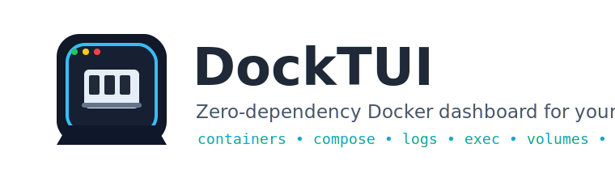

<p align="center">
  
</p>

[](https://opensource.org/licenses/MIT)
[](https://www.python.org/downloads/)
[](https://pypi.org/project/docktui/)
[](https://pepy.tech/project/docktui)
[](https://github.com/strmax195-hue/docktui/actions/workflows/tests.yml)
[](https://github.com/strmax195-hue/docktui/actions/workflows/tests.yml)
[](http://makeapullrequest.com)

**DockTUI** is a fast, zero-dependency terminal dashboard for monitoring, debugging, and managing local Docker containers and images. It is written in pure Python, talks to Docker through the Docker CLI, and keeps your existing Docker permissions and context intact.


Use DockTUI when you want something richer than repeated `docker ps`, `docker stats`, and `docker logs`, but lighter than a web dashboard or a heavyweight TUI framework.

---

## Why DockTUI?

- **Zero runtime dependencies**: install the package and run it. No Docker SDK, no TUI framework, no daemon sidecar.
- **Docker-native behavior**: DockTUI wraps the Docker CLI, so it respects your current Docker context, permissions, and platform setup.
- **Practical workflows**: start, stop, restart, rename, inspect, tail logs, execute commands, browse images, volumes, networks, and review disk usage from one terminal screen.
- **Compose-aware dashboard**: containers are grouped by Docker Compose project and service labels when available.
- **Safe cleanup flow**: destructive cleanup requires explicit confirmation and supports separate system, image, volume, and full prune actions.
- **Interactive settings editor**: refresh interval, log tail limit, theme, exec presets, and log highlight patterns can all be tuned from the dashboard (press `Shift+S`) and saved back to your config file.
- **Multi-host friendly**: register multiple remote endpoints in your config and switch between them with a single keypress, without touching `DOCKER_HOST` in your shell.
- **Friendly codebase**: small pure-Python modules, unit tests with subprocess mocking, and CI on Linux, macOS, and Windows.

## Key Features

| Area | What DockTUI gives you |
| --- | --- |
| **Docker dashboard** | Containers, Compose groups, images, volumes, networks, and contexts in one terminal UI. |
| **Daily actions** | Start, stop, restart, rename, inspect, delete images/volumes, run safe prune flows. |
| **Logs** | Follow mode, search, next-match navigation, error/warning-only filtering, regex highlighting, and adjustable tail size. |
| **Exec** | Preset, recent, and custom commands inside running containers. |
| **Details** | Readable container summary for ports, mounts, env, labels, networks, restart policy, and live CPU/memory limits. |
| **Registry & images** | Search Docker Hub and pull images directly from the Images tab with a live progress view. |
| **Multi-host** | Per-instance DOCKER_HOST switching and user-defined endpoint registry persisted in the config file. |
| **Resource limits** | Edit live CPU and memory allocations (wraps `docker update`) from the Details view. |
| **Container cloning** | Spawn a copy of a container (`docker run` with name and port overrides) from the Containers tab. |
| **Volume browser** | Drill into Docker volume files using a lightweight in-app directory explorer. |
| **Zero dependencies** | Pure Python standard library implementation; no Docker SDK or TUI framework required. |

---

## DockTUI vs alternatives

| Tooling style | Best for | Tradeoff |
| --- | --- | --- |
| `docker ps`, `docker logs`, `docker stats` | Maximum control and scripting | Repetitive for day-to-day monitoring |
| Web dashboards | Rich graphical management | Heavier setup and more moving parts |
| Full-featured TUI managers | Broad Docker workflows | Often depend on larger external runtimes |
| **DockTUI** | Lightweight local monitoring and quick actions | Intentionally focused on common local Docker tasks |

## Installation

**Option 1: Install from GitHub Releases (Recommended)**
```bash
pip install https://github.com/strmax195-hue/docktui/releases/download/v1.4.0/docktui-1.4.0-py3-none-any.whl
```

**Option 2: Install from PyPI**
```bash
pip install docktui
```

*(Alternatively, you can install the latest development branch from GitHub: `pip install git+https://github.com/strmax195-hue/docktui.git`)*

Local development:

```bash
git clone https://github.com/strmax195-hue/docktui.git
cd docktui
pip install -e .
```

---

## Usage

If your Python `Scripts` or `bin` directory is in your system `PATH`, you can simply run:
```bash
docktui
```

**Note:** If your terminal says `command not found` (which can happen on Windows), you can always launch it directly as a Python module:
```bash
python -m docktui
```

Useful options:
```bash
docktui --version
docktui --refresh-interval 5
docktui --docker-timeout 15
docktui --theme light
docktui --host ssh://user@remote-host
docktui -H tcp://192.168.1.100:2375
```

### Configuration File

DockTUI can load defaults from a JSON configuration file located at `~/.config/docktui/config.json` (or `~/.docktui.json`). Any options specified via command-line flags will override the configuration file defaults. You can edit the same options from inside the dashboard via **Shift+S** — saving writes them back to the file.

Example configuration:

```json
{
  "refresh_interval": 3.0,
  "docker_timeout": 15.0,
  "theme": "dark",
  "log_tail_limit": 100,
  "log_tail_step": 10,
  "log_max": 500,
  "cpu_alert_threshold": 80.0,
  "exec_history_cap": 10,
  "exec_presets": [
    "sh",
    "bash",
    "env",
    "ps aux",
    "df -h"
  ],
  "poll_intervals": {
    "containers": 3.0,
    "images": 15.0,
    "volumes": 30.0,
    "networks": 30.0,
    "contexts": 10.0
  },
  "hotkey_overlays": {
    "ctrl+l": "ls -l",
    "ctrl+e": "env"
  },
  "log_highlights": [
    {"label": "errors", "pattern": "ERROR|FAIL"},
    {"label": "auth",   "pattern": "AUTH|login"}
  ],
  "endpoints": [
    {"name": "prod",  "host": "ssh://user@prod.example",  "description": "Production"},
    {"name": "stage", "host": "tcp://10.0.0.5:2375",     "description": "Staging"}
  ],
  "active_endpoint": "prod"
}
```

### Remote Docker Daemons (SSH/TCP)

DockTUI supports connecting to remote Docker daemons via the standard `DOCKER_HOST` environment variable, or by passing the `--host` (or `-H`) command-line flag:

```bash
# Connect via SSH
docktui -H ssh://user@remote-host

# Connect via TCP
docktui -H tcp://192.168.1.100:2375
```

#### SSH Connection Requirements
When connecting via SSH, DockTUI executes commands non-interactively. This means that:
- Passwordless SSH authentication must be configured (e.g. using SSH public key authentication with keys loaded in your SSH agent).
- The remote host key must already be present in your local `known_hosts` file (otherwise, SSH prompts to confirm the host fingerprint and hangs).

#### Endpoint Switcher
For users who frequently switch between several remote daemons, the **endpoints** list in the config file (or the **N** key on the Contexts tab) provides a registry of named connections. Activating an endpoint updates DockTUI's per-instance `DOCKER_HOST` without modifying your shell environment. The active endpoint is highlighted in the title bar.

#### Contexts Tab Overrides
When `DOCKER_HOST` is active (either set via `--host` / `-H` CLI options or the `DOCKER_HOST` environment variable), Docker contexts are overridden. In the **Contexts** tab, DockTUI will display a warning, and context switching will be disabled since `DOCKER_HOST` forces all CLI operations to target the specified endpoint.

### Interactive Settings Editor

Press **Shift+S** from any tab to open the in-app **Settings** view. From here you can edit:

- Refresh interval
- Docker timeout
- Theme
- Log tail limit / step / max
- CPU alert threshold
- Exec history cap
- Exec presets (one per line)
- Log highlight patterns (`label=regex` per line)

Press **S** to save (writes to `~/.config/docktui/config.json`) and apply changes immediately, or **Esc** to discard.

### Hotkeys & Keyboard Navigation

#### Global Controls
- **`Tab` or `1`-`6`**: Switch between **Containers**, **Compose**, **Images**, **Volumes**, **Networks**, and **Contexts** tabs.
- **`↑` / `↓` (Arrow Keys) or Mouse Scroll Wheel**: Navigate list items and scroll text logs.
- **`G`**: Force refresh data.
- **`/`**: Filter list items by name/attributes on the active tab.
- **`C`**: Clear the active text search filter on the current tab.
- **`M`**: Cycle between **Dark**, **Light**, and **High-Contrast** theme presets.
- **`Shift+S`**: Open the in-app Settings editor.
- **`?`**: Open the in-app keyboard help screen.
- **`Q`**: Exit DockTUI.

#### Containers & Compose Tabs
- **`Ctrl+S`**: Bulk Start or Stop all containers matching the active filter.
- **`S`**: Start or Stop the selected container.
- **`S` on a Compose project row**: Start or stop all containers in that project group.
- **`R`**: Restart the selected container.
- **`R` on a Compose project row**: Restart all containers in that project group.
- **`L`**: Open fullscreen **Logs View** (supports real-time streaming using background threads, opens aggregated project logs when a Compose project row is selected).
- **`V`**: Open readable **Details View**.
- **`I`**: Open fullscreen interactive **Inspect View**.
- **`T`**: Open processes running inside the container (**Top View**).
- **`E`**: Execute a shell command inside the running container (prompts to run interactively via `docker exec -it` or in background **Exec View**).
- **`X`**: Generate and view a `docker-compose.yml` snippet representing the container configuration (**Compose Snippet View**).
- **`W`**: Edit live **CPU and memory limits** (`docker update`).
- **`Shift+C`**: Clone the selected container (name and ports pre-filled, image inherited).
- **`N`**: Rename the selected container.
- **`O`**: Cycle sort mode.
- **`Y`**: Cycle state filter.
- **`P`**: Open **System Disk Usage & Cleanup Dashboard**.

#### Images Tab
- **`D`**: Delete the selected image (asks for confirmation).
- **`F`**: Open the **Registry Search & Pull** dialog (Docker Hub).
- **`P`**: Open **System Disk Usage & Cleanup Dashboard**.

#### Volumes Tab
- **`D`**: Delete the selected volume (asks for confirmation).
- **`F`**: Open the **Volume File Browser**.
- **`P`**: Open **System Disk Usage & Cleanup Dashboard**.

#### Networks Tab
- **`D`**: Delete the selected network (asks for confirmation).

#### Contexts Tab
- **`U`**: Switch active Docker context to the selected context.
- **`N`**: Add a new endpoint (`name|host|description`) and activate it.

#### In-View Navigation (Logs, Inspect, Exec, Details, Top, System, Settings, Search, Pull, Files Views)
- **`↑` / `↓` (Arrow Keys) or Mouse Scroll Wheel**: Scroll content.
- **`Esc` or View Key**: Return back to the main dashboard.
- **Logs View Features**:
  - `P`: Pin the logs view to the bottom half of the terminal (Detachable Panes) and return to the main dashboard.
  - `F`: Toggle follow mode to keep refreshing and pinning logs to the newest lines.
  - `Space`: Pause follow mode.
  - `/`: Search/filter logs for specific terms.
  - `N`: Jump to the next search match.
  - `E`: Toggle error/warning-only log lines.
  - `H`: Toggle log highlight patterns (regex) from your config.
  - `O`: Export the current logs buffer to a local file.
  - `C`: Clear active log filters.
  - `+` / `-`: Increase/decrease log line retrieval limits.
- **Inspect, Details, Top, Compose Snippet Views**:
  - `P` (Details View only): Pin the details view to the bottom half of the terminal.
  - `O`: Export the current view buffer to a local file.
- **Exec View Features**:
  - `R`: Re-run the current command.
  - `E`: Execute a new preset, recent, or custom command (supports inline type-to-search auto-completion).
- **System View Features**:
  - `X`: Trigger `docker system prune -f` after typing `PRUNE`.
  - `I`: Trigger `docker image prune -f` after typing `IMAGES`.
  - `V`: Trigger `docker volume prune -f` after typing `VOLUMES`.
  - `A`: Trigger `docker system prune -f --volumes` after typing `ALL`.
- **Settings View Features**:
  - `Up` / `Down`: Move between settings.
  - `Enter`: Edit the highlighted setting.
  - `O`: Export settings to a file.
  - `S`: Save the configuration.
  - `Esc`: Return without saving.
- **Search & Pull View Features**:
  - `Up` / `Down`: Move through search results.
  - `Enter`: Pull the highlighted image (live progress view).
  - `O`: Export search results or pull progress to a file.
  - `Esc`: Cancel and return.
- **Volume File Browser Features**:
  - `Up` / `Down`: Move through entries.
  - `Enter`: Open a directory.
  - `Backspace`: Go up one level.
  - `O`: Export the file list to a file.
  - `Esc`: Return to the dashboard.

---

## Technical Architecture

DockTUI interfaces directly with the local Docker daemon by wrapping the `docker` command-line utility via subprocess execution. This guarantees that your existing Docker configurations, permissions, and security context are preserved without requiring complex SDK setups or elevated privilege daemons.

It implements a non-blocking cross-platform input capturing loop using:
- `msvcrt` on Windows.
- `select`, `termios`, and `tty` on Unix systems (Linux/macOS).

DockTUI's internals are split across focused modules:
- `docker_client.py` — subprocess wrapper with `DOCKER_HOST` parsing, per-instance host override, and helpers for every `docker` command used by the dashboard.
- `config.py` — `Config` dataclass for the JSON config file with load/save and validation.
- `constants.py` / `enums.py` — single source of truth for theme names, tabs, defaults, and view modes.
- `screen.py` / `styles.py` — terminal-size helpers, the standard `╔══╗…╚══╝` frame, ANSI theme colors, and string truncation utilities.
- `keymap.py` / `dialogs.py` — typed keymap registry and a small `DialogResult` value object that replaces the legacy inline `start_input` flow.
- `log_stream.py` — a reusable `LineStreamer` (background thread + line buffer) used by both log follow and image pull progress.
- `tui.py` — the dashboard orchestrator; each view is rendered by a single `draw_*` method and dispatched through a key-handler table.

---

## Running Tests

DockTUI includes an isolated unit test suite covering client operations via subprocess mocking, meaning you can run tests without a running Docker daemon:

```bash
python -m unittest discover tests
```

On Windows, `py -m unittest discover tests` also works when the Python launcher is installed.

The CI matrix runs the suite on Linux, macOS, and Windows across Python 3.8, 3.10, 3.12, and 3.13, and a separate `lint` job runs `ruff check .` against the codebase.

---

## Roadmap

See [ROADMAP.md](ROADMAP.md) for planned improvements, including richer Compose actions, detail views, export workflows, and theme polish.

## Releases

Release notes live in [CHANGELOG.md](CHANGELOG.md). Maintainers can use [docs/release-checklist.md](docs/release-checklist.md) when cutting GitHub releases.

---

## Contributing

Please read [CONTRIBUTING.md](CONTRIBUTING.md) to learn how to help improve DockTUI.

---

## License

This project is licensed under the MIT License - see the [LICENSE](LICENSE) file for details.
