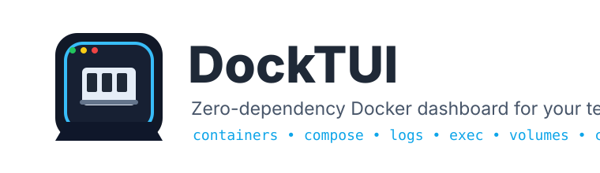
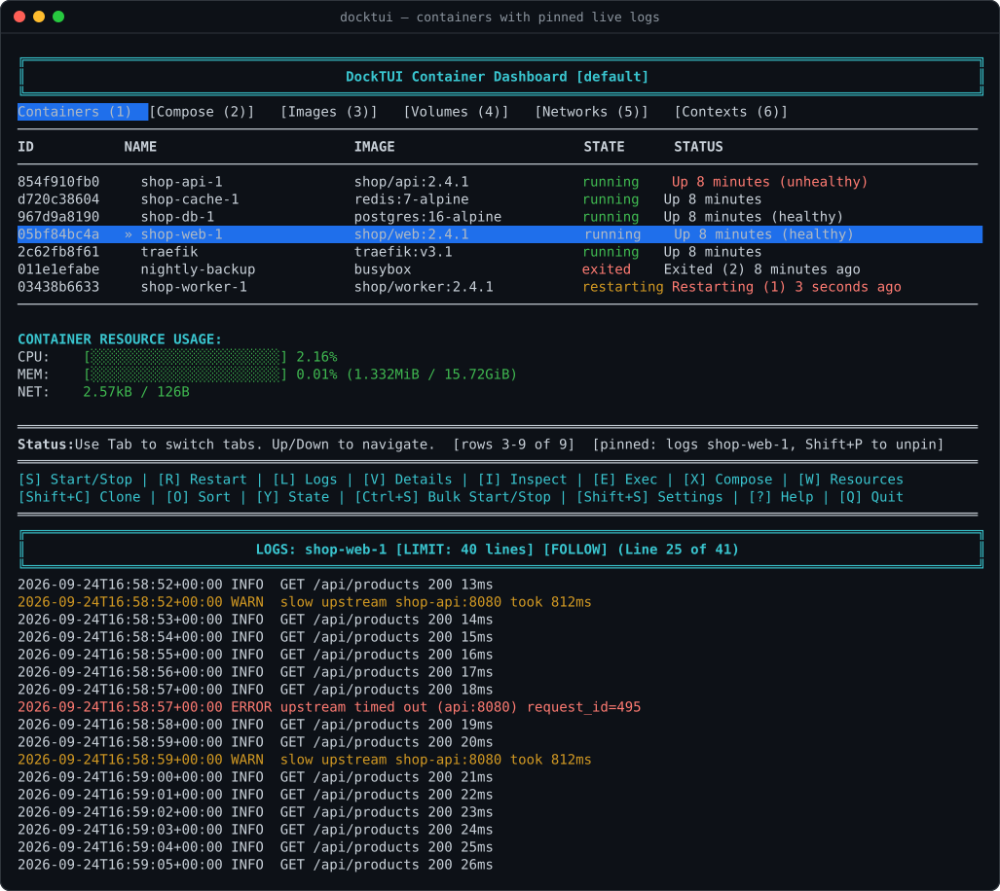
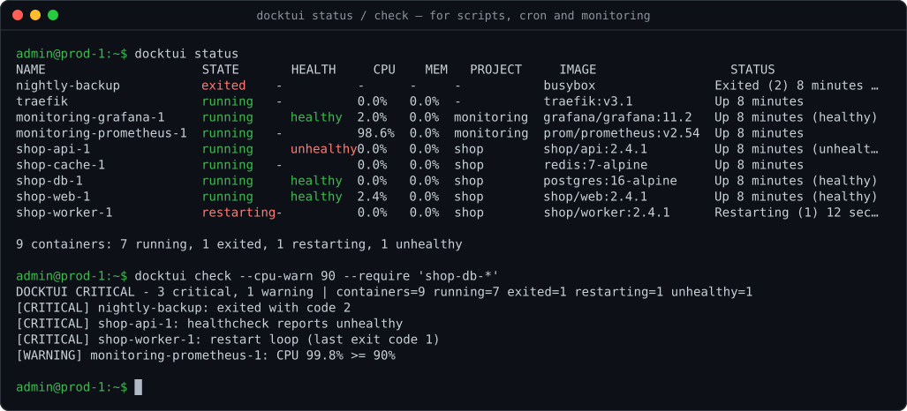
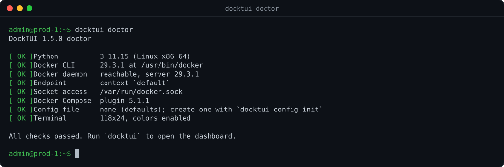
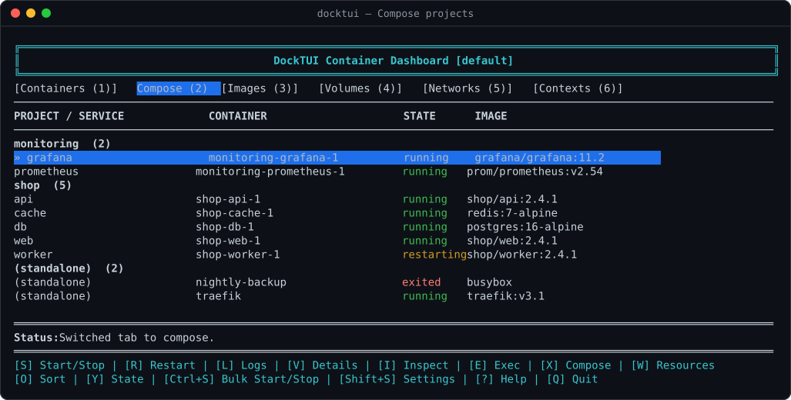

<p align="center">
  <picture>
    <source media="(prefers-color-scheme: dark)" srcset="assets/logo-dark.svg">
    
  </picture>
</p>

<p align="center">
  <b>The Docker dashboard for people who live in SSH sessions.</b><br>
  A zero-dependency terminal UI <i>and</i> a scriptable health checker for Docker hosts.
</p>

<p align="center">
  <a href="https://github.com/strmax195-hue/docktui/actions/workflows/tests.yml"></a>
  <a href="https://github.com/strmax195-hue/docktui/actions/workflows/codeql.yml"></a>
  <a href="https://www.python.org/downloads/"></a>
  
  <a href="LICENSE"></a>
  <a href="CONTRIBUTING.md"></a>
</p>

**DockTUI** is a fast terminal dashboard for monitoring, debugging and managing Docker containers, Compose stacks, images, volumes and networks. It is pure Python standard library, drives the regular `docker` CLI, and therefore works anywhere Docker works: your laptop, a jump host, a production box over SSH, or a remote daemon via `DOCKER_HOST`.

<p align="center">
  
</p>

It is also a **non-interactive tool for ops**: `docktui status` prints a snapshot, `docktui check` is a ready-made Nagios/Icinga/Zabbix/cron health check with proper exit codes, and `docktui doctor` tells you exactly why Docker isn't working.

<p align="center">
  
</p>

---

## Contents

- [Why admins like it](#why-admins-like-it)
- [Install](#install)
- [Quick start](#quick-start)
- [Scripting & monitoring](#scripting--monitoring) — `status`, `check`, `doctor`
- [Dashboard features](#dashboard-features)
- [Configuration](#configuration)
- [Remote hosts](#remote-docker-hosts-ssh--tcp)
- [Keyboard reference](#keyboard-reference)
- [Troubleshooting](#troubleshooting)
- [Development](#development)

## Why admins like it

- **Nothing to install on the server but Python.** No Go/Rust binary to ship, no Docker SDK, no TUI framework, no agent. `pipx install` and go — also on air-gapped hosts (copy one wheel).
- **Uses your existing Docker setup.** DockTUI shells out to `docker`, so contexts, `DOCKER_HOST`, TLS certs, SSH keys, rootless Docker and group permissions all just work.
- **Built for real hosts, not demos.** Scrollable lists for hundreds of containers, Compose-aware grouping, health status, crash/restart detection, bulk start/stop of a filtered set, and live logs pinned under the container list.
- **Scriptable.** JSON output, glob filters, and Nagios-compatible exit codes (`0` OK, `1` WARNING, `2` CRITICAL, `3` UNKNOWN).
- **Safe by default.** Destructive actions (delete, prune, bulk stop) ask for confirmation; prune requires typing a keyword.
- **Your shortcuts.** Bind `Ctrl+<letter>` to any command you run inside containers all day (`tail -f /var/log/app.log`, `env`, `df -h`).

## Install

DockTUI needs Python 3.9+ and the Docker CLI. It has **zero runtime dependencies**.

```bash
# Recommended: isolated install with pipx (or: uv tool install ...)
pipx install git+https://github.com/strmax195-hue/docktui.git

# Plain pip
pip install git+https://github.com/strmax195-hue/docktui.git

# A specific release wheel (see the Releases page for the file name)
pip install https://github.com/strmax195-hue/docktui/releases/download/v1.4.0/docktui-1.4.0-py3-none-any.whl
```

Air-gapped host? Download the `.whl` from [Releases](https://github.com/strmax195-hue/docktui/releases), copy it over, and `pip install docktui-*.whl` — there is nothing else to fetch.

If `docktui` is not on your `PATH` (common on Windows), run `python -m docktui` instead.

## Quick start

```bash
docktui doctor                 # check Docker CLI, daemon, permissions, compose, config, terminal
docktui                        # open the dashboard
docktui -H ssh://admin@prod-1  # dashboard for a remote daemon over SSH
docktui status                 # one-shot table of containers, then exit
docktui check                  # health check for scripts and monitoring
```

## Scripting & monitoring

All sub-commands accept `-H/--host`, `--docker-timeout` and `-c/--config`, and never need a TTY.

### `docktui status` — snapshot

```text
$ docktui status --filter 'shop*'
NAME          STATE       HEALTH     CPU    MEM    PROJECT  IMAGE              STATUS
shop-api-1    running     unhealthy  12.3%  41.0%  shop     shop/api:2.4.1     Up 3 hours (unhealthy)
shop-db-1     running     healthy    1.1%   22.5%  shop     postgres:16        Up 3 days (healthy)
shop-web-1    running     -          0.4%   3.2%   shop     nginx:1.27         Up 3 days

3 containers: 3 running, 0 exited, 0 restarting, 1 unhealthy
```

| Option | Meaning |
| --- | --- |
| `--json` | Machine-readable output (name, state, health, exit code, CPU %, memory %, Compose project/service, ports…) |
| `-f, --filter GLOB` | Only containers **or Compose projects** matching the glob (repeatable) |
| `-x, --exclude GLOB` | Skip matching containers/projects (repeatable) |
| `--no-stats` | Skip `docker stats` for a faster answer on busy hosts |

```bash
# Names of all unhealthy containers
docktui status --json --no-stats | jq -r '.[] | select(.health=="unhealthy") | .name'
```

### `docktui check` — health check with exit codes

`check` flags a container as **CRITICAL** when its healthcheck is `unhealthy`, it is in a restart loop, it is `dead`, it exited with a non-zero code (except `143`/SIGTERM from a normal `docker stop`), or a `--require`d container is missing or not running. It raises a **WARNING** for exit code `137` (OOM killer or stop timeout) and for CPU/memory at or above your thresholds.

```bash
docktui check --cpu-warn 90 --mem-warn 90 --require 'postgres*' --require 'nginx' --exclude 'ci-runner-*'
docktui check --json   # structured output
docktui check -q       # no output, exit code only
```

**Cron** — mail yourself only when something is wrong:

```cron
*/5 * * * *  docktui check --mem-warn 90 >/tmp/docktui-check.txt || mail -s "docker: $(head -1 /tmp/docktui-check.txt)" ops@example.com </tmp/docktui-check.txt
```

**Nagios / Icinga / NRPE** — the output already follows the plugin format (status line, perfdata after `|`, details below):

```ini
command[check_docker]=/usr/local/bin/docktui check --mem-warn 90 --require 'app-*'
```

**CI / deploy scripts** — fail a pipeline if the stack didn't come up healthy:

```bash
docker compose up -d && sleep 20 && docktui check --filter myproject --require 'myproject-web-*'
```

**Collection errors:** `check` returns UNKNOWN (3) when Docker data cannot be collected, or requested CPU/memory metrics are missing. `status` exits with 1; with `--json`, failures produce an object containing `status`, `exit_code`, and `error` (successful output remains an array). The dashboard marks its last successful snapshot as stale instead of silently emptying the list.

### `docktui doctor` — "why doesn't it work?"

<p align="center">
  
</p>

It also warns about unencrypted `tcp://…:2375` endpoints, a missing `ssh` client for `ssh://` hosts, broken config JSON and too-small terminals. Exit code is `1` if anything failed.

### `docktui config`

```bash
docktui config init    # write a config file with every option and its default
docktui config path    # where DockTUI reads/writes its config
docktui config show    # effective configuration as JSON (after CLI overrides)
```

## Dashboard features

<p align="center">
  
</p>

| Area | What you get |
| --- | --- |
| **Containers** | State, health and status at a glance; unhealthy/restarting rows highlighted; live CPU/memory/network bars with alert threshold; sort and state filters; scrolls smoothly through hundreds of containers. |
| **Compose** | Containers grouped by Compose project/service; start/stop/restart a whole project; `up`, `down`, `build`, `up --build`; aggregated project logs. |
| **Bulk actions** | Filter (`/`, `Y`) then `Ctrl+S` to stop or start the whole matching set in one Docker call. |
| **Logs** | Follow mode with live streaming, search and next-match, errors/warnings-only filter, regex highlights, adjustable tail, export to file, and **pin logs under the dashboard** (`P`) while you keep navigating. |
| **Exec** | Presets, history with type-to-search, background output view or a real interactive `docker exec -it` shell, plus your own `Ctrl+<letter>` hotkeys. |
| **Inspect & details** | Readable summary (ports, mounts, env, labels, networks, IP/MAC, restart policy, limits), raw `inspect` JSON, `docker top`, and a generated `docker-compose.yml` snippet. |
| **Change things** | Rename, clone with new name/ports, edit live CPU/memory limits (`docker update`). |
| **Images / volumes / networks** | Browse, delete with confirmation, Docker Hub search & pull with live progress, in-app volume file browser. |
| **Cleanup** | Disk-usage view with separate system / images / volumes / everything prune, each behind a typed confirmation. |
| **Hosts** | Docker contexts tab, `DOCKER_HOST`/`-H` support, and a named endpoint registry to hop between servers without touching your shell. |
| **Comfort** | Dark, light and high-contrast themes, `NO_COLOR` / `--no-color`, mouse-wheel scrolling, in-app settings editor (`Shift+S`), Windows/macOS/Linux. |

## Configuration

DockTUI reads the first file that exists:

1. `$DOCKTUI_CONFIG`
2. `$XDG_CONFIG_HOME/docktui/config.json`
3. `~/.config/docktui/config.json`
4. `~/.docktui.json`

…or the file given with `-c/--config`. Command-line flags override the file. `docktui config init` writes a complete file for you, and the in-app editor (`Shift+S`) saves back to the same file it was loaded from.

```json
{
  "refresh_interval": 3.0,
  "docker_timeout": 15.0,
  "theme": "dark",
  "log_tail_limit": 100,
  "log_tail_step": 10,
  "log_max": 500,
  "cpu_alert_threshold": 80.0,
  "exec_history_cap": 10,
  "exec_presets": ["sh", "bash", "env", "ps aux", "df -h"],
  "poll_intervals": {
    "containers": 3.0,
    "images": 15.0,
    "volumes": 30.0,
    "networks": 30.0
  },
  "hotkey_overlays": {
    "ctrl+l": "tail -n 200 /var/log/app/current.log",
    "ctrl+e": "env",
    "ctrl+d": "df -h"
  },
  "log_highlights": [
    {"label": "errors", "pattern": "ERROR|FATAL|panic"},
    {"label": "auth",   "pattern": "AUTH|login"}
  ],
  "endpoints": [
    {"name": "prod",  "host": "ssh://admin@prod.example", "description": "Production"},
    {"name": "stage", "host": "ssh://admin@stage.example", "description": "Staging"}
  ],
  "active_endpoint": "prod"
}
```

Notes:

- `hotkey_overlays` keys are `ctrl+<letter>`. `Ctrl+C/H/I/J/M/S/Z` are reserved by the terminal or DockTUI and are ignored. The command runs in the selected running container and opens in the Exec view.
- Invalid values (e.g. a string where a number belongs) fall back to defaults instead of crashing; `docktui doctor` points out broken JSON.

## Remote Docker hosts (SSH / TCP)

```bash
docktui -H ssh://admin@prod-1          # or: export DOCKER_HOST=ssh://admin@prod-1
docktui -H tcp://10.0.0.5:2376         # TLS; configure DOCKER_TLS_VERIFY / DOCKER_CERT_PATH as usual
```

- **Compose files:** Compose runs on the machine running DockTUI. Paths from a remote container's labels must exist locally; missing files or working directories are reported explicitly. Multiple config files keep their override order. Build/up operations allow at least 300 seconds.
- **SSH** runs non-interactively: use key-based auth (agent loaded) and make sure the host key is already in `known_hosts`, otherwise SSH waits for a prompt that never comes.
- **Plain `tcp://…:2375`** is unauthenticated and unencrypted; `docktui doctor` warns about it. Prefer `ssh://` or TLS on 2376.
- **Connection priority:** an explicit `-H` wins; otherwise Docker environment (`DOCKER_CONTEXT`, then `DOCKER_HOST`) wins over `active_endpoint` in config, followed by Docker's current context. All snapshot, streaming and interactive commands use the same connection; DockTUI never changes your process environment. An unknown configured endpoint produces a configuration error.
- **Endpoint switcher**: named `endpoints` in the config (or `N` on the Contexts tab) switch DockTUI's per-instance `DOCKER_HOST` without touching your shell environment. The active endpoint is shown in the title bar.
- When `DOCKER_HOST` is set, Docker contexts are overridden; the Contexts tab says so and disables switching.

## Keyboard reference

### Global Controls
- **`Tab` or `1`-`6`**: Switch between **Containers**, **Compose**, **Images**, **Volumes**, **Networks**, and **Contexts** tabs.
- **`↑` / `↓` (Arrow Keys) or Mouse Scroll Wheel**: Navigate list items and scroll text logs.
- **`G`**: Force refresh data.
- **`/`**: Filter list items by name/attributes on the active tab.
- **`C`**: Clear the active text search filter on the current tab.
- **`M`**: Cycle between **Dark**, **Light**, and **High-Contrast** theme presets.
- **`Shift+S`**: Open the in-app Settings editor.
- **`?`**: Open the in-app keyboard help screen.
- **`Q`**: Exit DockTUI.

### Containers & Compose Tabs
- **`Ctrl+S`**: Bulk start or stop every container matching the active filter/state (asks for confirmation, runs as one `docker stop`/`docker start`).
- **`Ctrl+<letter>`**: Run your own `hotkey_overlays` command in the selected container.
- **`Shift+P`**: Unpin the pinned logs/details pane.
- **`S`**: Start or Stop the selected container.
- **`S` on a Compose project row**: Start or stop all containers in that project group.
- **`R`**: Restart the selected container.
- **`R` on a Compose project row**: Restart all containers in that project group.
- **`L`**: Open fullscreen **Logs View** (supports real-time streaming using background threads, opens aggregated project logs when a Compose project row is selected).
- **`V`**: Open readable **Details View**.
- **`I`**: Open fullscreen interactive **Inspect View**.
- **`T`**: Open processes running inside the container (**Top View**).
- **`E`**: Execute a shell command inside the running container (prompts to run interactively via `docker exec -it` or in background **Exec View**).
- **`X`**: Generate and view a `docker-compose.yml` snippet representing the container configuration (**Compose Snippet View**).
- **`W`**: Edit live **CPU and memory limits** (`docker update`).
- **`Shift+C`**: Clone the selected container (name and ports pre-filled, image inherited).
- **`N`**: Rename the selected container.
- **`O`**: Cycle sort mode.
- **`Y`**: Cycle state filter.
- **`P`**: Open **System Disk Usage & Cleanup Dashboard**.

### Images Tab
- **`D`**: Delete the selected image (asks for confirmation).
- **`F`**: Open the **Registry Search & Pull** dialog (Docker Hub).
- **`P`**: Open **System Disk Usage & Cleanup Dashboard**.

### Volumes Tab
- **`D`**: Delete the selected volume (asks for confirmation).
- **`Shift+F`**: Open the **Volume File Browser**.
- **`P`**: Open **System Disk Usage & Cleanup Dashboard**.

### Networks Tab
- **`D`**: Delete the selected network (asks for confirmation).

### Contexts Tab
- **`U`**: Switch active Docker context to the selected context.
- **`N`**: Add a new endpoint (`name|host|description`) and activate it.

### In-View Navigation (Logs, Inspect, Exec, Details, Top, System, Settings, Search, Pull, Files Views)
- **`↑` / `↓` (Arrow Keys) or Mouse Scroll Wheel**: Scroll content.
- **`Esc` or View Key**: Return back to the main dashboard.
- **Logs View Features**:
  - `P`: Pin the logs under the dashboard (they keep following live) and return to the container list; `Shift+P` unpins.
  - `F`: Toggle follow mode to keep refreshing and pinning logs to the newest lines.
  - `Space`: Pause follow mode.
  - `/`: Search/filter logs for specific terms.
  - `N`: Jump to the next search match.
  - `E`: Toggle error/warning-only log lines.
  - `H`: Toggle log highlight patterns (regex) from your config.
  - `O`: Export the current logs buffer to a local file.
  - `C`: Clear active log filters.
  - `+` / `-`: Increase/decrease log line retrieval limits.
- **Inspect, Details, Top, Compose Snippet Views**:
  - `P` (Details View only): Pin the details view to the bottom half of the terminal.
  - `O`: Export the current view buffer to a local file.
- **Exec View Features**:
  - `R`: Re-run the current command.
  - `E`: Execute a new preset, recent, or custom command (supports inline type-to-search auto-completion).
- **System View Features**:
  - `X`: Trigger `docker system prune -f` after typing `PRUNE`.
  - `I`: Trigger `docker image prune -f` after typing `IMAGES`.
  - `V`: Trigger `docker volume prune -f` after typing `VOLUMES`.
  - `A`: Trigger `docker system prune -f --volumes` after typing `ALL`.
- **Settings View Features**:
  - `Up` / `Down`: Move between settings.
  - `Enter`: Edit the highlighted setting.
  - `O`: Export settings to a file.
  - `S`: Save the configuration.
  - `Esc`: Return without saving.
- **Search & Pull View Features**:
  - `Up` / `Down`: Move through search results.
  - `Enter`: Pull the highlighted image (live progress view).
  - `O`: Export search results or pull progress to a file.
  - `Esc`: Cancel and return.
- **Volume File Browser Features**:
  - `Up` / `Down`: Move through entries.
  - `Enter`: Open a directory.
  - `Backspace`: Go up one level.
  - `O`: Export the file list to a file.
  - `Esc`: Return to the dashboard.

## Troubleshooting

Start with **`docktui doctor`** — it checks every item below and prints the fix.

| Symptom | Fix |
| --- | --- |
| `Cannot connect to the Docker daemon` | Start Docker Desktop / `sudo systemctl start docker`. |
| `permission denied … docker.sock` | `sudo usermod -aG docker $USER`, then log out and back in (or use rootless Docker). |
| Remote host hangs on start | SSH is waiting for a password or host-key prompt. Use key auth and `ssh admin@host` once to accept the key. |
| `docktui: command not found` | Your Python scripts directory is not on `PATH`; use `pipx`, or run `python -m docktui`. |
| Colors look wrong / you want none | `--theme light`, `--theme high-contrast`, or `--no-color` (`NO_COLOR=1`). |
| Commands time out on a slow host | Increase `--docker-timeout` (or `docker_timeout` in the config). |

Streaming buffers are bounded (500 lines by default; pull progress follows `log_max`). Completion distinguishes success, failure, and cancellation. On Unix, canceled streams also terminate their process group, including SSH helpers.

## How it works

DockTUI wraps the `docker` CLI via `subprocess`, so your existing configuration, permissions and security context are preserved without an SDK or a privileged helper. Input is read non-blockingly with `msvcrt` on Windows and `termios`/`select` on Unix.

| Module | Responsibility |
| --- | --- |
| `cli.py` | Argument parsing, sub-commands and dashboard start-up |
| `report.py` | Pure functions behind `status` / `check` (health parsing, rules, text/JSON output) |
| `doctor.py` | Environment diagnostics |
| `docker_client.py` | `docker` subprocess wrapper, `DOCKER_HOST` parsing, per-instance host override |
| `config.py` | `Config` dataclass: lookup paths, load/validate/save |
| `tui.py` | Dashboard orchestrator: one `draw_*` method per view, key-handler table |
| `log_stream.py` | Background `LineStreamer` for log follow and image pulls |
| `screen.py` / `styles.py` / `keymap.py` / `dialogs.py` | Layout helpers, themes, key bindings, input dialogs |

## Development

```bash
git clone https://github.com/strmax195-hue/docktui.git
cd docktui
pip install -e ".[dev]"
pre-commit install        # optional: ruff + mypy on every commit

pytest                    # unit tests; no Docker daemon required (subprocess is mocked)
ruff check . && ruff format --check .
mypy
```

The screenshots in this README are generated from the real UI: `scripts/demo/up.sh` starts a demo environment and `python scripts/screenshots.py` (needs `pip install pyte`) re-renders `assets/screenshot-*.svg`.

CI runs the tests on Linux, macOS and Windows with Python 3.9–3.14, lint and type checks, CodeQL, and an integration job that exercises `status`/`check`/`doctor` against a real Docker daemon.

See [CONTRIBUTING.md](CONTRIBUTING.md) to get started, [ROADMAP.md](ROADMAP.md) for what's next, and [CHANGELOG.md](CHANGELOG.md) for release notes. Maintainers: [docs/release-checklist.md](docs/release-checklist.md).

If DockTUI saves you a few `docker ps` a day, a ⭐ on GitHub helps other admins find it.

## License

MIT — see [LICENSE](LICENSE).
